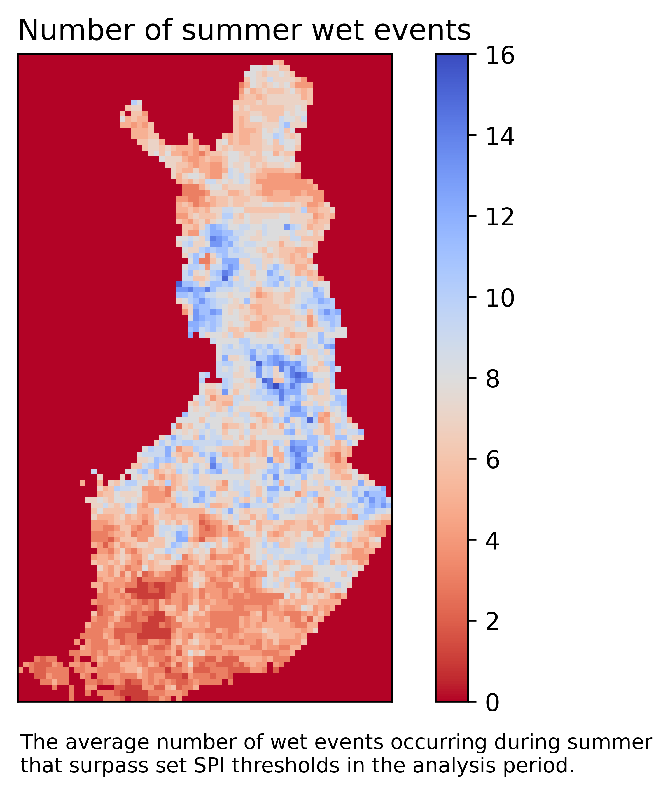
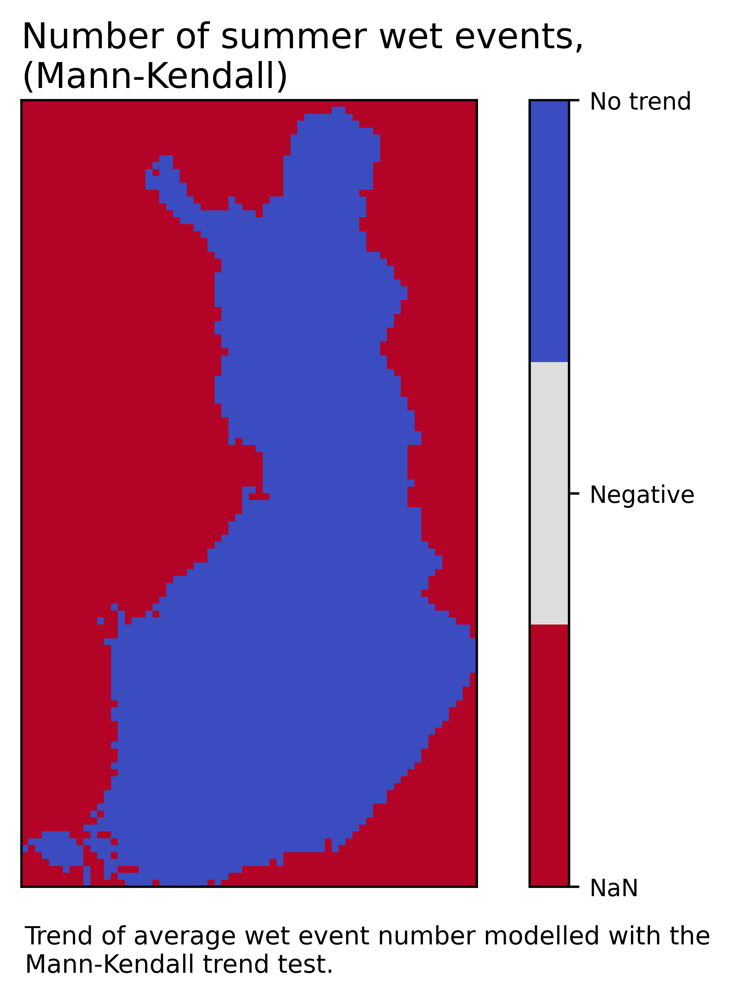
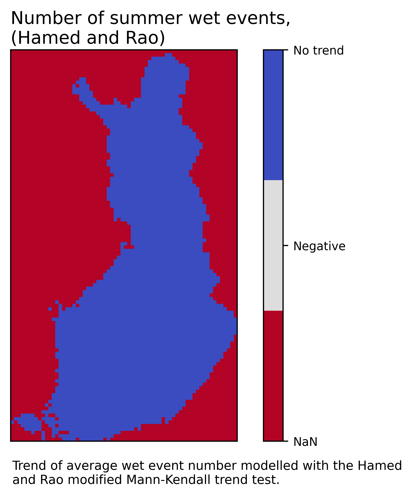
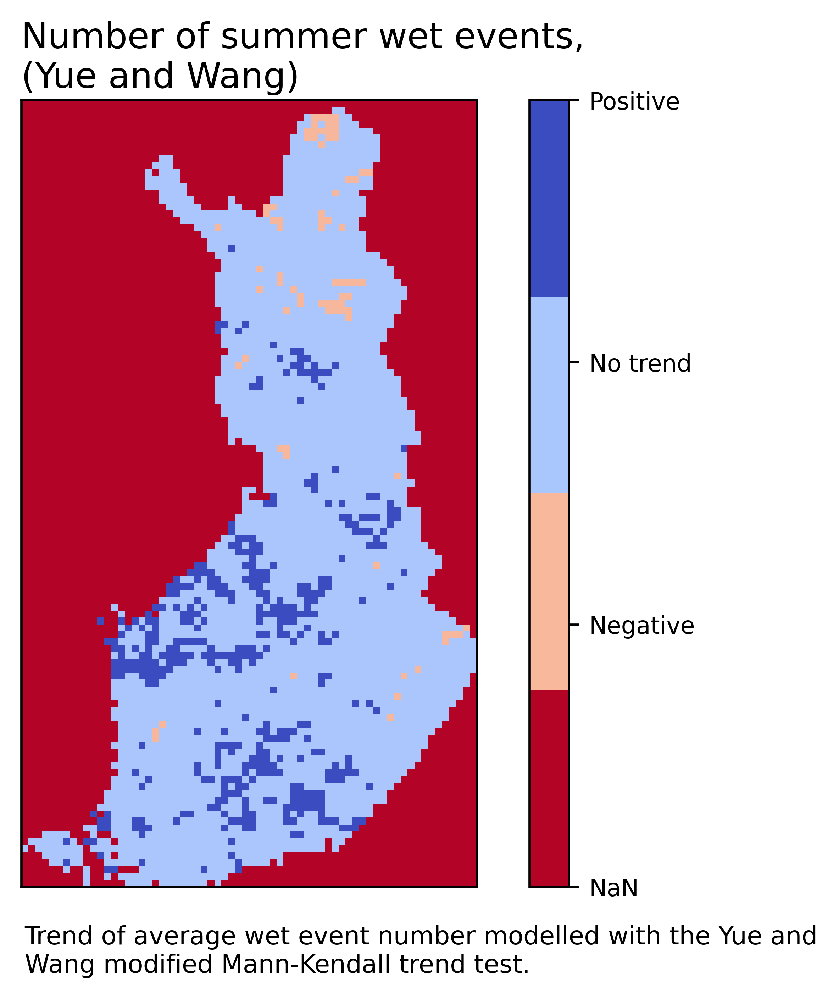

# SPI Event Trend Detector

**Author:** Tuomas Haapala  
**Contact:** [E-mail](mailto:tuomas.haapala@aalto.fi), [LinkedIn](https://www.linkedin.com/in/tuomas-haapala-850812262/), [ORCID](https://orcid.org/0009-0008-8431-6235)  
**Organization:** Aalto University  
**Website:** https://github.com/TuomasJGH/SPI_Event_Trend_Detector

## Project Overview
This project detects trends in precipitation events based on the Standardized Precipitation Index and standard and modified Mann-Kendall trend tests.
It is a representative first step in constructing a digital twin of Finnish agricultural conditions as software that accesses, adjusts and presents relevant meteorological hydrological data and analysis results based on user specifications.
This project is intended to provide an accessible tool to analyze precipitation event changes with variable inputs.

### Background
Climate change impacts in Finland disrupt historical agricultural conditions. 
Increasing temperatures cause shorter winters with less snowcover, which in turn decreases the effect of the groundwater-replenishing water pulse generated by snowmelt. 
Fewer water resources, low precipitation during crop development and an already short growing season result in very precarious agricultural conditions.

Improved precipitation estimates are required to improve water management in agricultural conditions. 
Precipitation is a crucial source of agricultural water resources and a clear indicator of local water availability, and it is expected to change variably across Finland. 
Therefore, historical precipitation patterns and events should be analyzed for the change that has already occurred in order to estimate which regions will experience challenges or potential prospects related to water resource availability.

### Literature
The Standardized Precipitation Index was developed by McKee et al. (1993), and it has since been widely used to analyze and distinguish changes in precipitation patterns. 
The precise methodology used in this project is taken from research by Lloyd-Hughes and Saunders (2002), where the accumulation period is used to create a daily time series of precipitation sums for the preceding accumulation period. 
This precipitation sum time series is then transformed into a standardized normal distribution using the gamma distribution, resulting in the SPI time series.
The values in the series depict the deviation of the accumulation period -based precipitation sum from the mean of the time series. 

SPI with different accumulation periods are noted as SPI-n, where n is the number of months included in the accumulation period, often in the range of 1 to 12. 
SPI with shorter accumulation periods are better at describing short-term events, while longer accumulation periods describe long-term phenomena. 
In this project, SPI-1 is used as the default setting to focus on short-term changes that occur during the comparatively short growing season in Finland. 

### General research questions
<ul>
  <li>How have SPI-based precipitation events changed in Finland during the last century?</li>
  <li>Are there spatial concentrations present in the results?</li>
</ul>    

## Data Sources
This project uses openly available gridded precipitation data provided by the Finnish Meteorological Institute (FMI, 2026). 
The data is in the form of NetCDF grid files, where each file contains a year's daily precipitation time series in each cell. 
Grid size is 1147*661, and values outside Finland are masked.

Data is currently available for years 1961 to 2025, with new years appended as their data is available.

### Data Source Description
| Name | Source | Description | Access Method | URL | Details | Citation |
|------|--------|-------------|---------------|-----|---------|----------|
| rrday_(year).nc | Finnish Meteorological Institute | Yearly grids containing daily precipitation data for Finland | Direct access via URL | [URL](http://fmi-gridded-obs-daily-1km.s3-website-eu-west-1.amazonaws.com/) | Spatial resolution: 1 km2, EPSG:3067 projection | Finnish Meteorological Institute. (2026) Daily observations in 1km*1km grid. Available from: [http://fmi-gridded-obs-daily-1km.s3-website-eu-west-1.amazonaws.com](http://fmi-gridded-obs-daily-1km.s3-website-eu-west-1.amazonaws.com) |

### Data Access Notes - SE1
Data access code is based on work by Porokhivnyk (2024).
One year of precipitation data is roughly 1 GB in size - it is recommended to delete the NetCDF files once processed data and maps are available.  
The analysis period is specified here.

## Methods

### Data Processing - SE2
The discretisation step and accumulation period are specified here.  
Once the precipitation files are ready, the code processes each cell with two for loops of the NetCDF grid's shape.
For each cell, the precipitation time series for every analysis year are combined and then formed into a daily time series of accumulation period precipitation sums.
The SPI transformation is then applied, resulting in an array where each cell contains the SPI time series of its precipitation data.
This array is then ravelled into a 1D .csv for saving.
The discretisation step and the length of the analysis period in both days and years are saved in to a separate file.
A list and a mask for date values during summer are also saved.

### Data Analysis - SE3
The event start and end thresholds are specified here.  
The SPI map is read and reshaped to the original grid.
With the set event thresholds, each event in the SPI time series where the values cross beyond the event thresholds during summer are recorded to yearly values by their length and number.

Three different trend tests are then applied to the yearly value series for length and number: the Mann-Kendall trend test, the Hamed and Rao modified Mann-Kendall test, and the Yue and Wang modified Mann-Kendall trend test. These trend tests are used together to gain a thorough perspective on present SPI trends, and the tests are performed for event length and the average event length for both dry and wet events occurring during summer. Trend direction and slope are calculated.

## Repository Structure

| Folder / File | Description |
|-------------|-------------|
| notebooks_final/ | SE1–SE4 notebooks |
| inputs/ | folder where SE1 uploads and which SE2 accesses for NetCDF input data |
| processed_data/ | SE2 analysis-ready dataset outputs |
| maps/ | SE3 map array outputs |
| figures/ | SE4 figure outputs |
| run_reproducibility.py | Reproducibility wrapper |
| CITATION.cff | Citation metadata |

## Reproducibility

### Computational requirements
The code is reproducible with the 'Xsmall (4 CPU, 8GB RAM)' setting of the DIWA DataLab.

### Inputs
Project files are designed to be adjustable to account for user-specific inputs for the following key properties of SPI event trend analysis:

| Input | Suggestions | Default |
|-------|-------------|---------|
| Discretisation step | 1, 10, 100 | 10 |
| Accumulation period | 1 (30d) 3 (90d) 6 (180d) 12 (360d) |1 (30 days)|
| Dry event thresholds | -4-0 | -1 |
| Wet event thresholds | 0-4 | 1 |
| Analysis years | 1961-2025 | 1999-2001 |

The default inputs were used to test the function and verify the reproducibility of the code.

### Run the code
```bash
pip install -r requirements.txt
python run_reproducibility.py
```

## Results
The figures obtained with default inputs are presented here.

|  Event map  | Trends (Mann-Kendall) | Trends (Hamed and Rao) | Trends (Yue and Wang) |
|-------------|-----------------------|------------------------|-----------------------|
|||||
|||||
|||||
|||||

The event maps show that while there are spatial concentrations of SPI events across Finland, the locations may not correspond with event trend locations.
For example, while a large number of dry events are present on the southwestern coast, signalling precarious conditions, they have not experienced significant change during the analysis period.
The choice of trend test affects recorded event trends - with the default dataset, only the Yue and Wang modified Mann-Kendall trend test is able to distinguish significant trends in the dataset.
The Mann-Kendall and Hamed and Rao modified trend tests have been able to detect trends for longer analysis periods, but they were not sensitive enough for the default inputs.  

During the default analysis period of 1999-2001, no trends are present for the majority of Finland in terms of both events.
However, dry event trends tend toward decreasing trends and wet events toward increasing trends, highlighting a general trend toward wetter conditions.
Decreasing dry event length and increasing wet event number trends are present on the western coast, which is one of the more prominent agricultural regions in the country.

Increasing the length of the analysis period allows for more robust and significant trends to be recorded for Finland.
Long-term trends highlight how the precipitation in the region has responded to climate change.
An openly available tool with variable inputs for location and event severity thresholds allows users and the agricultural sector to prepare accordingly for changes in available water resources.

## Citation
Tuomas J. G. Haapala (2026).
*SPI Event Trend Detector* (Version 1.0).
Aalto University.

**BibTeX**
```bibtex
@software spi_event_trend_detector,
  author = Tuomas Haapala,
  title = SPI Event Trend Detector,
  year = 2026,
  version = 1.0,
  url = https://github.com/TuomasJGH/SPI_Event_Trend_Detector
}
```
## License
MIT License

Copyright (c) 2026 Tuomas Jaakko Gabriel Haapala

Permission is hereby granted, free of charge, to any person obtaining a copy
of this software and associated documentation files (the "Software"), to deal
in the Software without restriction, including without limitation the rights
to use, copy, modify, merge, publish, distribute, sublicense, and/or sell
copies of the Software, and to permit persons to whom the Software is
furnished to do so, subject to the following conditions:

The above copyright notice and this permission notice shall be included in all
copies or substantial portions of the Software.

THE SOFTWARE IS PROVIDED "AS IS", WITHOUT WARRANTY OF ANY KIND, EXPRESS OR
IMPLIED, INCLUDING BUT NOT LIMITED TO THE WARRANTIES OF MERCHANTABILITY,
FITNESS FOR A PARTICULAR PURPOSE AND NONINFRINGEMENT. IN NO EVENT SHALL THE
AUTHORS OR COPYRIGHT HOLDERS BE LIABLE FOR ANY CLAIM, DAMAGES OR OTHER
LIABILITY, WHETHER IN AN ACTION OF CONTRACT, TORT OR OTHERWISE, ARISING FROM,
OUT OF OR IN CONNECTION WITH THE SOFTWARE OR THE USE OR OTHER DEALINGS IN THE
SOFTWARE.

## Contribution Guidelines
Contributions that improve the quality, clarity, and reproducibility of this project are welcome.
* Open an issue before making major or result-affecting changes.
* Keep pull requests focused and clearly describe what changed and why.
* Follow existing code style and update documentation as needed.
* Do not modify code or data used to reproduce published results without discussion.
* Ensure workflows remain reproducible.
* Do not commit large or restricted datasets.
* Respect data licenses.
By contributing, you agree that your work will be released under the project’s license.

## References

Finnish Meteorological Institute. (2026) Daily observations in 1km*1km grid. Available at:
https://en.ilmatieteenlaitos.fi/gridded-observations-on-aws-s3

McKee, T. B., Doesken, N. J., Kleist, J. (1993) The relationship of drought frequency and duration to time scales. 8th Conference on Applied Climatology, Anaheim, 17-22 January 1993.

Lloyd-Hughes, B., Saunders, M. A. (2002) A drought climatology for Europe. International Journal
of Climatology. https://doi.org/10.1002/joc.846

Porokhivnyk, T. (2024) Automated computational tool for simulating field-scale agricultural hydrology and water management. Aalto University. Available at: https://aaltodoc.aalto.fi/items/ad5f0c49-16aa-4eb6-9f5a-123d86773082

