# SPI Event Trend Detector

**Author:** Tuomas Haapala  
**Contact:** [E-mail](mailto:tuomas.haapala@aalto.fi), [LinkedIn](https://www.linkedin.com/in/tuomas-haapala-850812262/), [ORCID](https://orcid.org/0009-0008-8431-6235)  
**Organization:** Aalto University  
**Website:** https://github.com/TuomasJGH/SPI_Event_Trend_Detector

## Project Overview
This project detects trends in precipitation events based on the Standardized Precipitation Index and standard and modified Mann-Kendall trend tests.
It is a representative first step in constructing a digital twin of Finnish agricultural conditions as software that accesses, adjusts and presents relevant meteorological hydrological data and analysis results based on user specifications.
This project is intended to provide an accessible tool to analyze precipitation event changes with variable inputs.

### Background
Climate change impacts in Finland disrupt historical agricultural conditions. 
Increasing temperatures cause shorter winters with less snowcover, which in turn decreases the effect of the groundwater-replenishing water pulse generated by snowmelt. 
Fewer water resources, low precipitation during crop development and an already short growing season result in very precarious agricultural conditions.

Improved precipitation estimates are required to improve water management in agricultural conditions. 
Precipitation is a crucial source of agricultural water resources and a clear indicator of local water availability, and it is expected to change variably across Finland. 
Therefore, historical precipitation patterns and events should be analyzed for the change that has already occurred in order to estimate which regions will experience challenges or potential prospects related to water resource availability.

### Literature
The Standardized Precipitation Index was developed by McKee et al. (1993), and it has since been widely used to analyze and distinguish changes in precipitation patterns. 
The precise methodology used in this project is taken from research by Lloyd-Hughes and Saunders (2002), where the accumulation period is used to create a daily time series of precipitation sums for the preceding accumulation period. 
This precipitation sum time series is then transformed into a standardized normal distribution using the gamma distribution - the SPI time series.

SPI with different accumulation periods are noted as SPI-n, where n is the number of months included in the accumulation period, often in the range of 1 to 12. 
SPI with shorter accumulation periods are better at describing short-term events, while longer accumulation periods describe long-term phenomena.

In the daily SPI time series, the daily value depicts the deviation of the precipitation sum from the mean of the time series. 

### General research questions
<ul>
  <li>How have SPI-based precipitation events changed in Finland during the last century?</li>
  <li>Is there spatial autocorrelation present in the trend results?</li>
</ul>    

## Data Sources
Describe your study area, and period of interest. Specify whether training data represents a different location/time period than forecast simulations. Detail the temporal and spatial frequency of your process.

This project uses openly available gridded precipitation data provided by the Finnish Meteorological Institute (FMI, 2026). 
The data is in the form of NetCDF grid files, where each file contains a year's daily precipitation time series in each cell. 
Grid size is 1147*661, and values outside Finland are masked.

Data is currently available for years 1961 to 2025, with updates adding data for the current year.

### Published Data Sources
| Name | Source | Description | Access Method | URL | Details | Citation |
|------|--------|-------------|---------------|--------------|---------|---------------|
| rrday_(year).nc | Finnish Meteorological Institute | Yearly grids containing daily precipitation data for Finland | Direct access via URL | [URL](http://fmi-gridded-obs-daily-1km.s3-website-eu-west-1.amazonaws.com/) | Spatial resolution: 1 km2, EPSG:3067 projection | Finnish Meteorological Institute. (2026) Daily observations in 1km*1km grid. Available from: [http://fmi-gridded-obs-daily-1km.s3-website-eu-west-1.amazonaws.com](http://fmi-gridded-obs-daily-1km.s3-website-eu-west-1.amazonaws.com) |

### Data Access Notes
In the "How to Reproduce," descripe how to configure automatic access control mechanisms for each data source. 

### Inputs folder
Any direct data download links can be pasted into the "datalinks.txt" file in the inputs folder. 
Specify which dataset links can be accessed via the datalinks.txt folder. 
Note: this should only be used for PDIs: if the url changes, it will break the reproducibility of your workflow.

Detail any datasets that are in your inputs data folder. 
Note this is only for data that is too small/trivial to be published: **no files greater than 10 MB can be stored in repository**. 
Examples might include spatial polygons that have undergone geometry simplification for API searches, text-based keys mapping variable names to integer values, etc.

## Methods
### Data Processing - SE2
Describe steps involved in data preprocessing

### Data Analysis - SE3

## Repository Structure

| Folder / File | Description |
|-------------|-------------|
| notebooks_final/ | SE1–SE4 notebooks |
| inputs/ | folder where SE1 uploads and which SE2 accesses for NetCDF input data |
| processed_data/ | SE2 analysis-ready dataset outputs |
| maps/ | SE3 map array outputs |
| figures/ | SE4 figure outputs |
| run_reproducibility.py | Reproducibility wrapper |
| CITATION.cff | Citation metadata |

## Reproducibility

### Computational requirements
The code is reproducible with the 'Xsmall (4 CPU, 8GB RAM)' setting of the DIWA DataLab.

### Data access configurations
Describe in detail any access control mechanisms that need to be configured for an individual user to access data (e.g. tokens, cookies, certificates, URL customization). Provide links to documentation.


### Inputs
Project files are designed to be adjustable to account for user-specific inputs for the following key properties of SPI event trend analysis:
<ul>
  <li>Discretisation step</li>
  <li>Accumulation period</li>
  <li>Dry event thresholds</li>
  <li>Wet event thresholds</li>
  <li>Analysis years (minimum of three)</li>
</ul>

A set of default inputs was used to test and verify the function and reproducibility of the code. Sample figures are based on these inputs.

<ul>
  <li>Discretisation step: 10</li>
  <li>Accumulation period: 1</li>
  <li>Dry event thresholds: Start: -1, End: -1</li>
  <li>Wet event thresholds: Start: 1, End: 1</li>
  <li>Analysis years (minimum of three): 1999 - 2001</li>
</ul>

### Run the code
```bash
pip install -r requirements.txt
python run_reproducibility.py
```

## Results
The figures obtained with default inputs are presented here.

|  Event map  | Trends (Mann-Kendall) | Trends (Hamed and Rao) | Trends (Yue and Wang) |
|-------------|-----------------------|------------------------|-----------------------|
|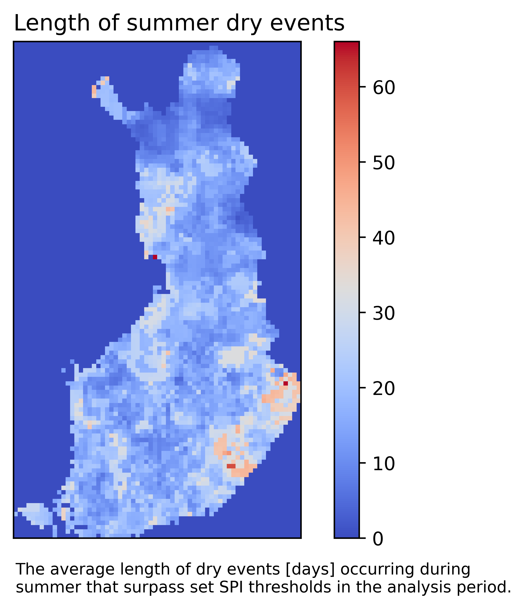|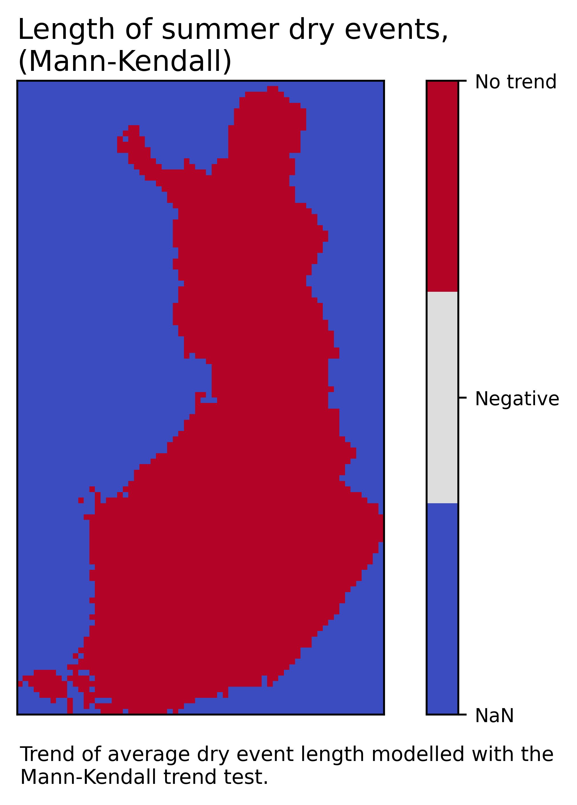|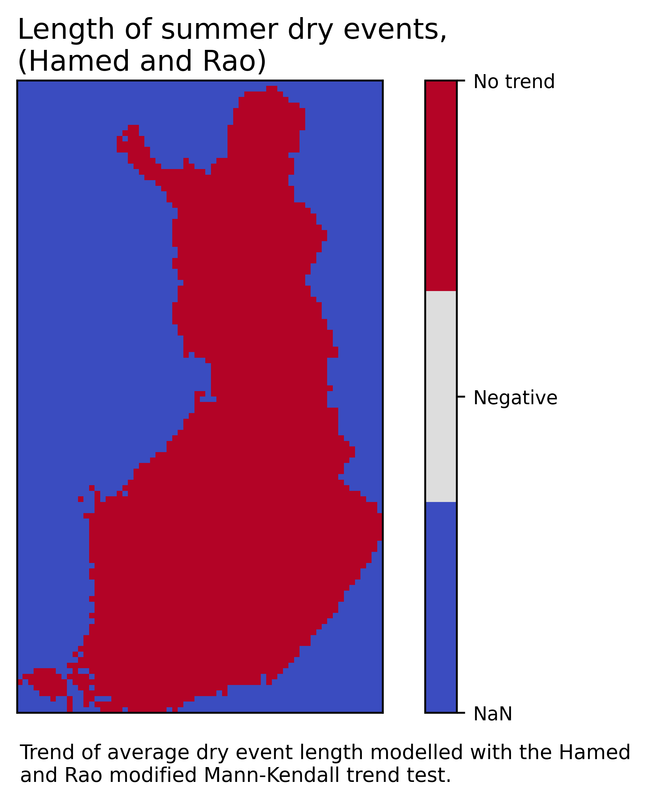|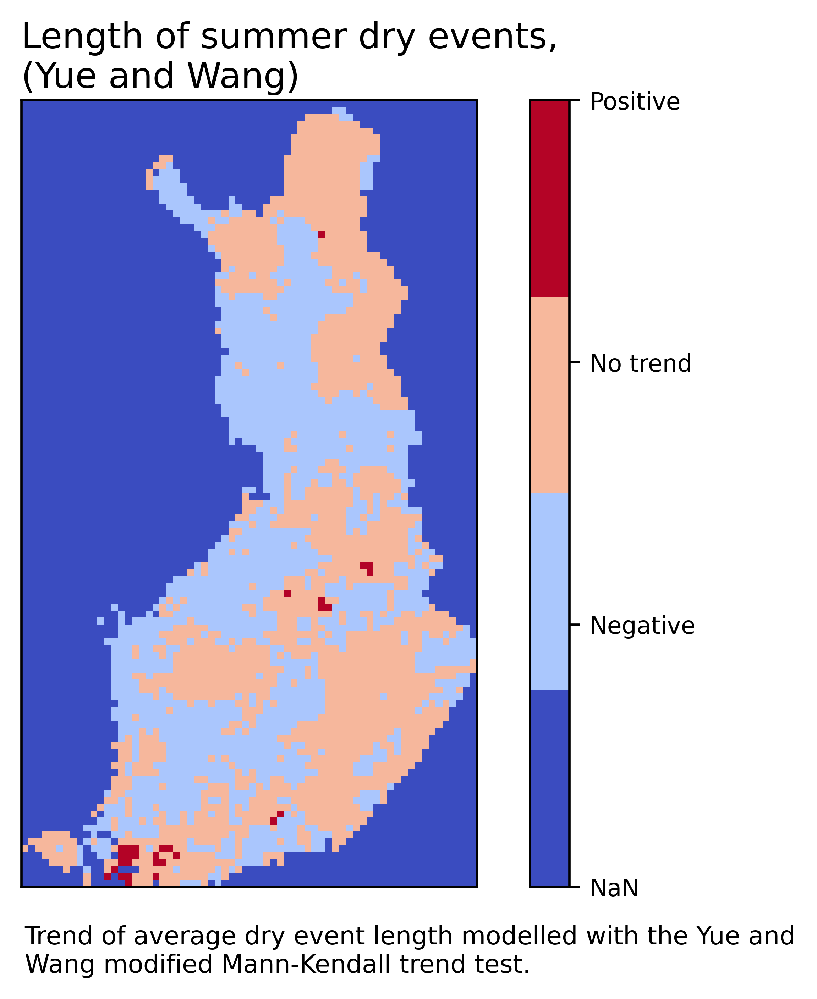|
|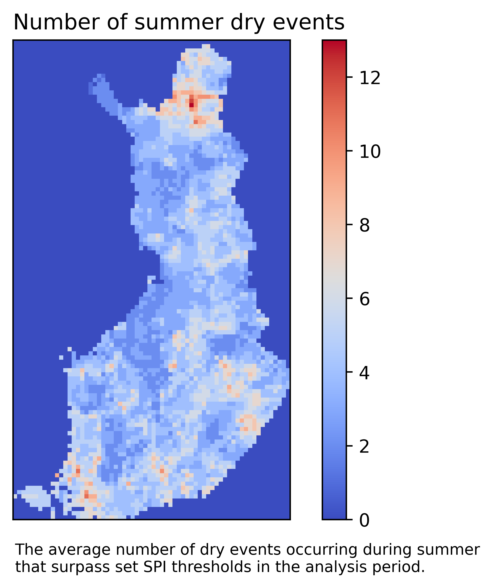|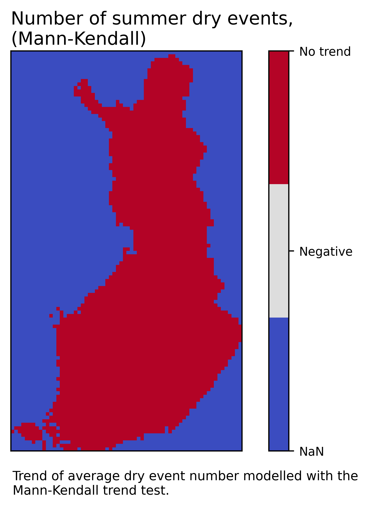|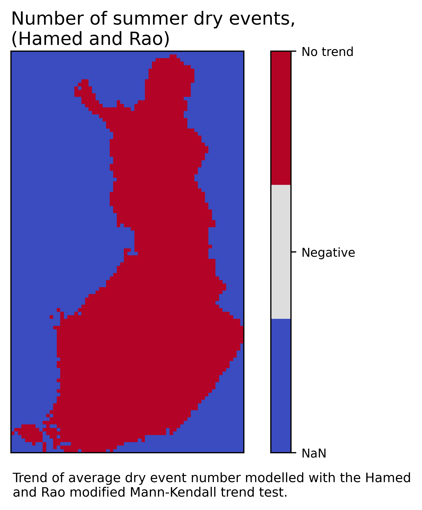|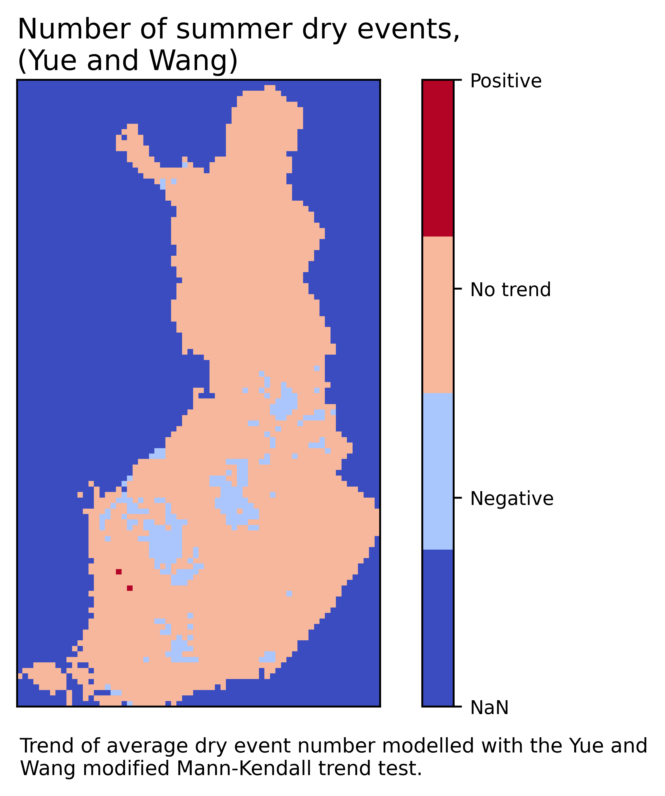|
|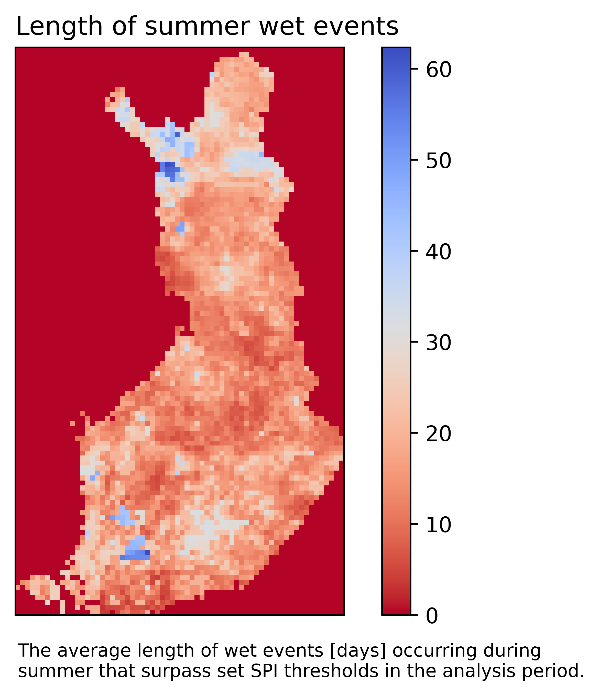|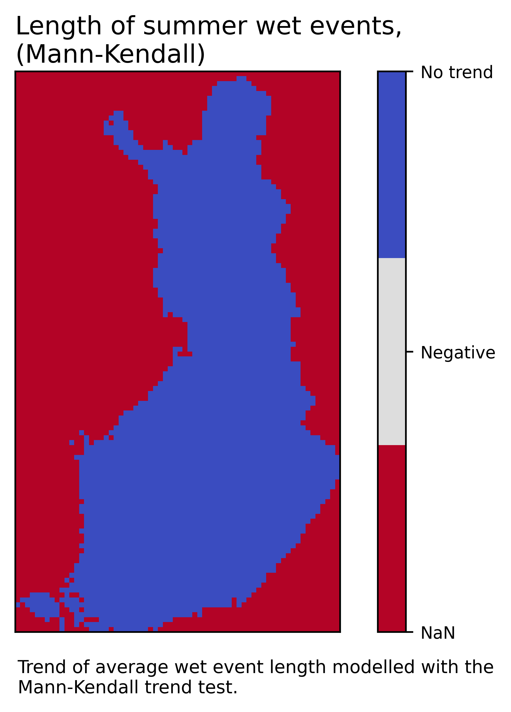|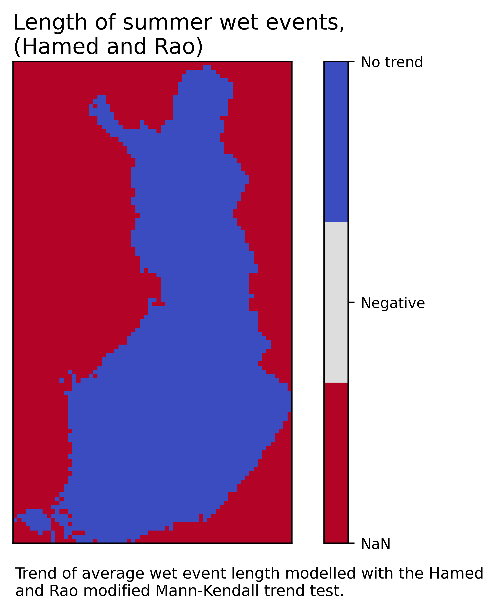|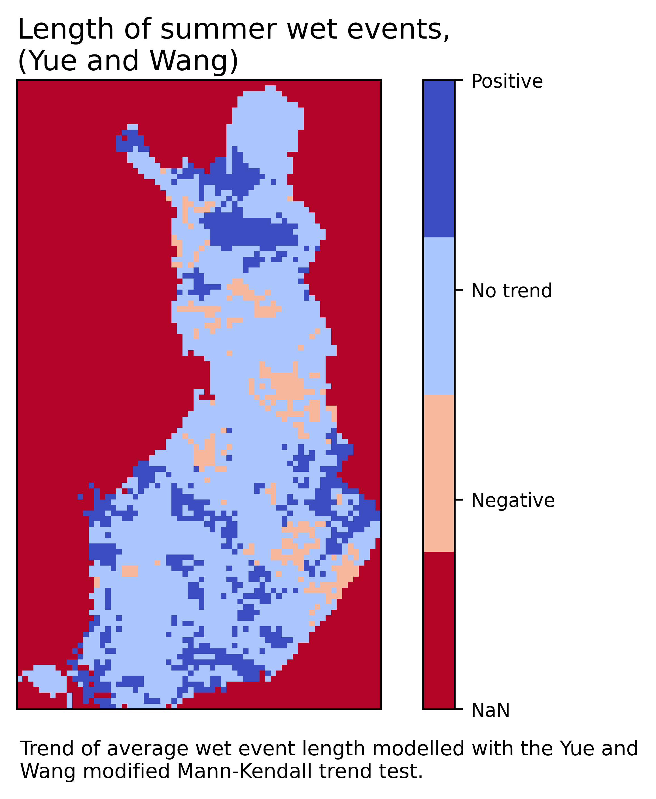|
|||||


## Citation
Tuomas J. G. Haapala (2026).
*SPI Event Trend Detector* (Version 1.0).
Aalto University.

**BibTeX**
```bibtex
@software spi_event_trend_detector,
  author = Tuomas Haapala,
  title = SPI Event Trend Detector,
  year = 2026,
  version = 1.0,
  url = https://github.com/TuomasJGH/SPI_Event_Trend_Detector
}
```
## License
MIT License

Copyright (c) 2026 Tuomas Jaakko Gabriel Haapala

Permission is hereby granted, free of charge, to any person obtaining a copy
of this software and associated documentation files (the "Software"), to deal
in the Software without restriction, including without limitation the rights
to use, copy, modify, merge, publish, distribute, sublicense, and/or sell
copies of the Software, and to permit persons to whom the Software is
furnished to do so, subject to the following conditions:

The above copyright notice and this permission notice shall be included in all
copies or substantial portions of the Software.

THE SOFTWARE IS PROVIDED "AS IS", WITHOUT WARRANTY OF ANY KIND, EXPRESS OR
IMPLIED, INCLUDING BUT NOT LIMITED TO THE WARRANTIES OF MERCHANTABILITY,
FITNESS FOR A PARTICULAR PURPOSE AND NONINFRINGEMENT. IN NO EVENT SHALL THE
AUTHORS OR COPYRIGHT HOLDERS BE LIABLE FOR ANY CLAIM, DAMAGES OR OTHER
LIABILITY, WHETHER IN AN ACTION OF CONTRACT, TORT OR OTHERWISE, ARISING FROM,
OUT OF OR IN CONNECTION WITH THE SOFTWARE OR THE USE OR OTHER DEALINGS IN THE
SOFTWARE.

## Contribution Guidelines
Contributions that improve the quality, clarity, and reproducibility of this project are welcome.
* Open an issue before making major or result-affecting changes.
* Keep pull requests focused and clearly describe what changed and why.
* Follow existing code style and update documentation as needed.
* Do not modify code or data used to reproduce published results without discussion.
* Ensure workflows remain reproducible.
* Do not commit large or restricted datasets.
* Respect data licenses.
By contributing, you agree that your work will be released under the project’s license.

## References

Finnish Meteorological Institute. 2026. Daily observations in 1km*1km grid. Available at:
https://en.ilmatieteenlaitos.fi/gridded-observations-on-aws-s3

McKee, T. B., Doesken, N. J., Kleist, J. 1993. The relationship of drought frequency and duration to time scales. 8th Conference on Applied Climatology, Anaheim, 17-22 January 1993.

Lloyd-Hughes, B., Saunders, M. A. 2002. A drought climatology for Europe. International Journal
of Climatology. https://doi.org/10.1002/joc.846


